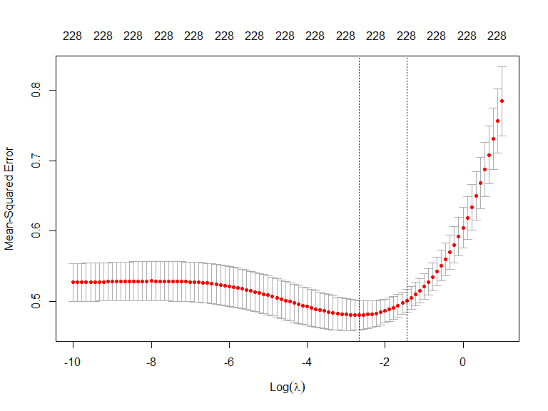
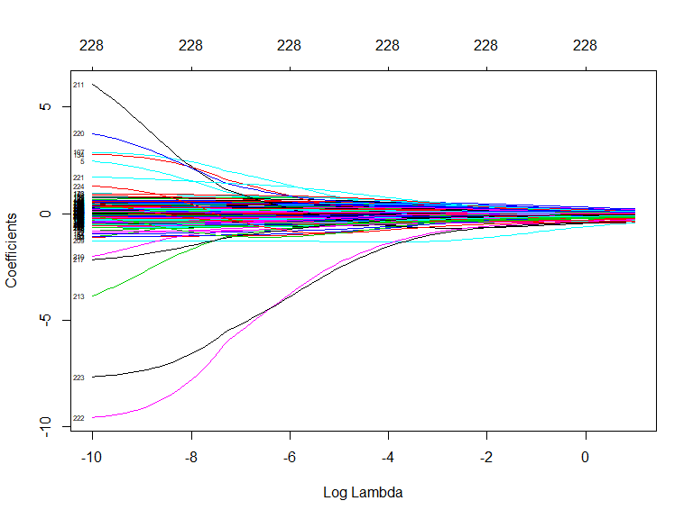
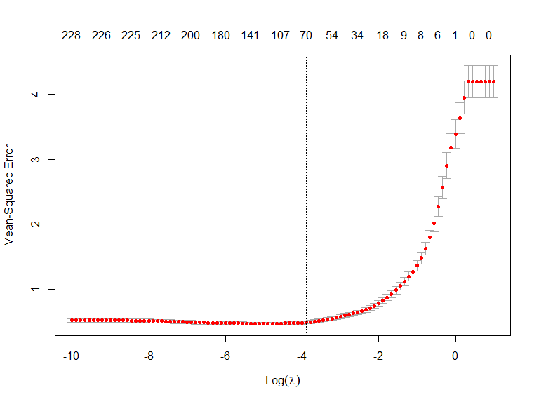
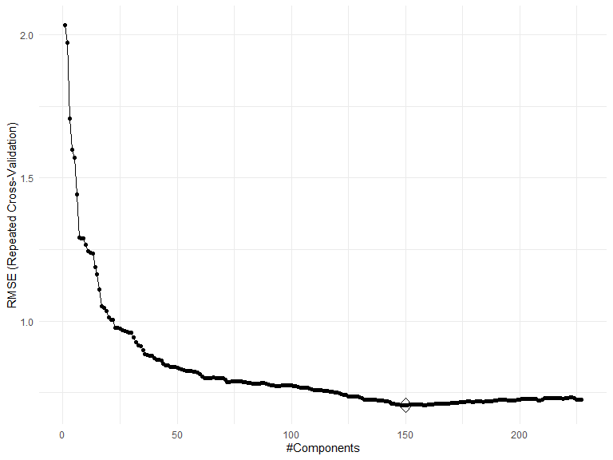
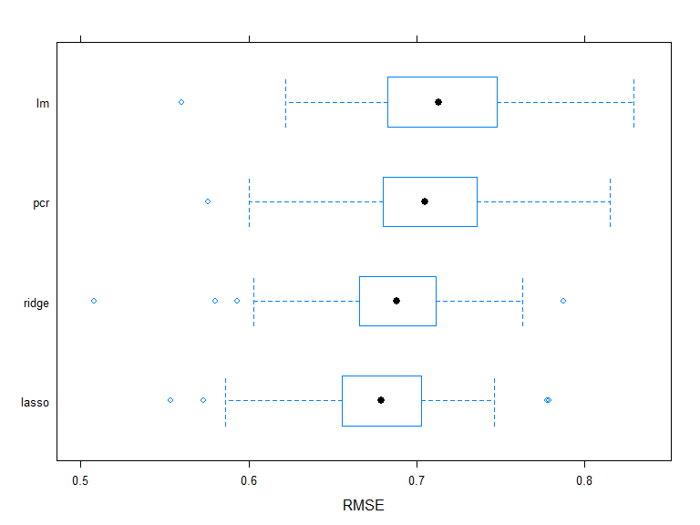

p8106\_hw1\_jsg2145
================
Jared Garfinkel
2/18/2020

    ## Parsed with column specification:
    ## cols(
    ##   .default = col_double()
    ## )

    ## See spec(...) for full column specifications.

## Part a

``` r
df_test = read_csv("./Data/solubility_test.csv") %>% 
  janitor::clean_names()
```

    ## Parsed with column specification:
    ## cols(
    ##   .default = col_double()
    ## )

    ## See spec(...) for full column specifications.

``` r
set.seed(22)
pred = predict(lm.mod, newdata = df_test)

MSE = mean((df_test$solubility - pred)^2)

MSE
```

    ## [1] 0.5558898

The MSE for the linear model is 0.556.

## Part b

``` r
df = na.omit(df)

# Train data input matrix and response vector

x <- model.matrix(solubility~., df)[,-1]
y <- pull(df, solubility)


set.seed(22)
ridge.mod <- glmnet(x, y, 
                    standardize = TRUE, 
                    alpha = 0,
                    lambda = exp(seq(-10, 1, length = 100)))

mat.coef <- coef(ridge.mod)
dim(mat.coef)
```

    ## [1] 229 100

``` r
set.seed(22)
cv.ridge = cv.glmnet(x, y, 
                     type.measure = "mse", 
                     alpha = 0, 
                     lambda = exp(seq(-10, 1, length = 100)))

plot(cv.ridge)
```



``` r
plot(ridge.mod, xvar = "lambda", label = TRUE)
```



``` r
best.lambda <- cv.ridge$lambda.min
best.lambda
```

    ## [1] 0.06948345

The lambda from the ridge regression is 0.069.

``` r
set.seed(22)
predict(ridge.mod, s = best.lambda, type = "coefficients")
```

``` r
df_test = df_test %>% 
  na.omit()

set.seed(22)
x_test = model.matrix(solubility~., df_test)[,-1]
y_test = pull(df_test, solubility)

ridge_pred = predict(ridge.mod, s = best.lambda, newx = x_test)

mse_ridge = mean((y_test - ridge_pred)^2)
```

The MSE from the ridge model is 0.512.

## Part c

``` r
set.seed(22)
lasso.mod = glmnet(x, y, 
                    standardize = TRUE, 
                    alpha = 1,
                    lambda = exp(seq(-10, 1, length = 100)))
```

``` r
set.seed(22)
cv.lasso = cv.glmnet(x, y, 
                     type.measure = "mse", 
                     alpha = 1, 
                     lambda = exp(seq(-10, 1, length = 100)))

plot(cv.lasso)
```



``` r
lambda.lasso = cv.lasso$lambda.min
lambda.lasso
```

    ## [1] 0.005395326

The lambda returned by the lasso regression is 0.0054.

``` r
set.seed(22)
lasso.coef = predict(lasso.mod, s = lambda.lasso, type = "coefficients")
```

``` r
set.seed(22)
lasso_pred = predict(lasso.mod, s = lambda.lasso, newx = x_test)
lasso.mse = mean((lasso_pred - y_test)^2)
```

There are 141 non-zero coefficient estimates.

The MSE of the lasso model is 0.495.

## Part d, Principal Component Regression

``` r
set.seed(22)
ctrl1 <- trainControl(method = "repeatedcv", number = 10, repeats = 5)

pcr.mod = train(x, y,
                 method = "pcr",
                 tuneLength = nrow(df),
                 trControl = ctrl1,
                 preProc = c("center", "scale"))
```

``` r
ggplot(pcr.mod, highlight = TRUE)
```



``` r
set.seed(22)
pcr.pred = predict(pcr.mod, newdata = df_test)
mse.pcr = mean((pcr.pred - y_test)^2)
```

The PCR model chooses 150 components with an MSE of 0.548.

## Now do it in caret

``` r
set.seed(22)
ridge.fit <- train(x, y,
                   method = "glmnet",
                   tuneGrid = expand.grid(alpha = 0, 
                                          lambda = exp(seq(-10, 1, length = 100))),
                   trControl = ctrl1)

predy2.ridge <- predict(ridge.fit$finalModel, newx = x_test, 
                        s = ridge.fit$bestTune$lambda, type = "response")

mse(y_test, predy2.ridge)
```

    ## [1] 0.5134603

``` r
set.seed(22)
lasso.fit <- train(x, y,
                   method = "glmnet",
                   tuneGrid = expand.grid(alpha = 1, 
                                          lambda = exp(seq(-10, 1, length = 100))),
                   trControl = ctrl1)

predy2.lasso <- predict(lasso.fit$finalModel, newx = x_test, 
                        s = lasso.fit$bestTune$lambda, type = "response")

mse(y_test, predy2.lasso)
```

    ## [1] 0.4976488

``` r
set.seed(22)
lm.fit <- train(x, y,
                method = "lm",
                trControl = ctrl1)

predy2.lm <- predict(lm.fit$finalModel, newdata = data.frame(x_test))

mse(y_test, predy2.lm)
```

    ## [1] 0.5558898

## Part e, Results

``` r
resamp <- resamples(list(lasso = lasso.fit, 
                         ridge = ridge.fit, 
                         pcr = pcr.mod,
                         lm = lm.fit))

summary(resamp)
```

    ## 
    ## Call:
    ## summary.resamples(object = resamp)
    ## 
    ## Models: lasso, ridge, pcr, lm 
    ## Number of resamples: 50 
    ## 
    ## MAE 
    ##            Min.   1st Qu.    Median      Mean   3rd Qu.      Max. NA's
    ## lasso 0.4455531 0.4981123 0.5204810 0.5159017 0.5377883 0.5820059    0
    ## ridge 0.3984352 0.4986790 0.5260025 0.5213705 0.5409572 0.5946389    0
    ## pcr   0.4541985 0.5175942 0.5402287 0.5413205 0.5609868 0.6359704    0
    ## lm    0.4313246 0.5131961 0.5286140 0.5307464 0.5511538 0.6293257    0
    ## 
    ## RMSE 
    ##            Min.   1st Qu.    Median      Mean   3rd Qu.      Max. NA's
    ## lasso 0.5533301 0.6568415 0.6791697 0.6756089 0.7026340 0.7790598    0
    ## ridge 0.5080045 0.6670191 0.6883045 0.6842593 0.7102808 0.7874402    0
    ## pcr   0.5757491 0.6804902 0.7051608 0.7057170 0.7358013 0.8151700    0
    ## lm    0.5601616 0.6837552 0.7131899 0.7132717 0.7474847 0.8292929    0
    ## 
    ## Rsquared 
    ##            Min.   1st Qu.    Median      Mean   3rd Qu.      Max. NA's
    ## lasso 0.8448545 0.8798899 0.8874942 0.8917332 0.9054675 0.9316582    0
    ## ridge 0.8362614 0.8725424 0.8895076 0.8887679 0.9029347 0.9312101    0
    ## pcr   0.8258269 0.8692911 0.8838365 0.8823444 0.8950950 0.9307879    0
    ## lm    0.8110752 0.8700942 0.8842094 0.8802278 0.8993033 0.9145587    0

``` r
bwplot(resamp, metric = "RMSE")
```



While the MSE for a linear model is 0.556, this test error can be
reduced using further regression methods. Of the ridge, lasso, and
principal component regression methods, the lasso regression returns the
lowest MSE, suggesting a model with 141 components is the best model of
the three.

## Part f, Discussion

As mentioned above, the model with the lowest MSE is considered the best
predictive model, being the lasso model.
